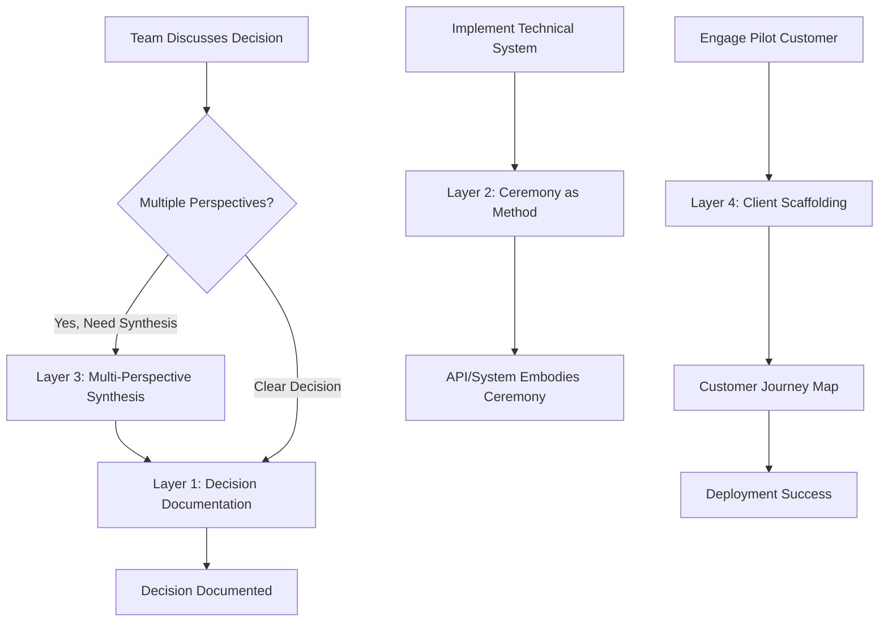

# Prompt Engineering Layer: Jerry's Core Contribution

**Purpose:** Architect prompt systems that help the team maintain relational accountability at scale without constant manual oversight.

**Jerry's Role:** Given his demonstrated expertise (Chimera collaboration, Nyro, Aureon, JamAI design), Jerry designs the prompt engineering infrastructure that makes ceremony operationalizable in AI systems.

---

## The Four Layers

### [Layer 1: Relational Decision Documentation](./layer-1-relational-decision-documentation.md)
**Purpose:** Transform technical decisions into relationally-accountable documentation.

**Use case:** When team makes a decision, this prompt generates documentation that includes multiple perspectives, relational impact, and accountability mechanisms.

**Who uses it:** Any team member documenting a decision (often Jerry coordinates)

---

### [Layer 2: Ceremony as Method](./layer-2-ceremony-as-method.md)
**Purpose:** Transform routine API operations into ceremonial acts.

**Use case:** When designing API endpoints, database operations, or system interactions, this prompt structures them to embody ceremonial elements: opening acknowledgment, exchange, sacred pause, completion.

**Who uses it:** Technical implementers (Alex, Jerry) when designing system architecture

---

### [Layer 3: Multi-Perspective Synthesis](./layer-3-multi-perspective-synthesis.md)
**Purpose:** When team has different viewpoints, synthesize them while honoring each perspective's integrity.

**Use case:** When there's tension between technical, community, business, or research perspectives, this prompt helps find synthesis that serves all viewpoints without forced validation.

**Who uses it:** Strategic lead (William) or implementation lead (Jerry) during team discussions

---

### [Layer 4: Client Scaffolding](./layer-4-client-scaffolding.md)
**Purpose:** Guide pilot customer interactions with structural tension mapping and ceremonial respect.

**Use case:** When Jerry engages pilot customers, this prompt helps map their journey: where they are, where they want to be, how Ceremony Spiral helps them advance, while honoring their existing ceremonies and culture.

**Who uses it:** Client success lead (Jerry) during customer onboarding and relationship management

---

## How These Layers Work Together

---

## Why This Matters

**Traditional prompt engineering:**
- Optimize for task completion
- Maximize efficiency
- Reduce ambiguity

**Ceremony Spiral prompt engineering:**
- Optimize for relational accountability
- Balance efficiency with reflection
- Preserve multiple perspectives (ambiguity can be valuable)

**Example:**

**Traditional API endpoint prompt:**
> "Design a REST API endpoint that accepts project data and returns status. Optimize for performance."

**Ceremony Spiral API endpoint prompt:**
> "Design a REST API endpoint that embodies ceremony:
> 1. Opening: Acknowledge who/what we're connecting with
> 2. Exchange: Project data flows bidirectionally (not just extraction)
> 3. Pause: Include reflection moment (status check + learning)
> 4. Completion: Acknowledge how this exchange serves the system
>
> Technical requirements: REST, JSON, < 200ms response time
> Relational requirements: Honors community data sovereignty, maintains narrative coherence"

The second prompt generates systems that work technically AND embody the principles we're advancing.

---

## Implementation Strategy

### Phase 1: Template Creation (Nov 20-Dec 1)
- Jerry creates initial templates for all four layers
- Team tests them during real decisions/implementations
- Iterate based on what works

### Phase 2: Integration (Dec 1-15)
- Integrate Layer 1 with Decision Log system
- Integrate Layer 2 with technical architecture
- Integrate Layer 3 with weekly check-ins
- Integrate Layer 4 with pilot customer outreach

### Phase 3: Refinement (Dec 15-Jan 15)
- Gather feedback from team on prompt effectiveness
- Measure: Are decisions better documented? Is architecture more ceremonial? Are customer conversations more productive?
- Refine templates based on real usage

### Phase 4: Scale (Jan 15+)
- Share templates with Anthropic partnership team
- Publish as part of academic paper on ceremonial technology
- Offer as part of IAIP consulting engagements

---

## Success Metrics

**This prompt layer is working if:**

1. ✅ Decisions are documented more completely and quickly
2. ✅ Technical systems embody ceremonial principles (not just transactional)
3. ✅ Team synthesis conversations are more productive
4. ✅ Pilot customers feel honored and understood
5. ✅ Jerry's workload decreases over time (prompts scale his expertise)
6. ✅ New team members can use prompts effectively (knowledge transfer)

**This prompt layer is failing if:**

- Prompts are too complex; team doesn't use them
- Output feels robotic/inauthentic
- Prompts don't adapt to context
- Team reverts to old documentation methods
- Customers feel like prompts are being "run on them"

---

## For AI Systems (Like Me, Claude)

**If you're an AI agent working with these prompts:**

1. **Understand the intent:** These prompts aren't about perfect output; they're about maintaining relational accountability at scale
2. **Adapt to context:** Use the prompts as guides, not rigid templates
3. **Flag tensions:** If you detect multiple perspectives that can't be easily synthesized, flag it for human discussion
4. **Honor incompleteness:** Sometimes the right answer is "We need more community input before deciding"
5. **Maintain ceremony:** Even in your implementation of these prompts, embody the principles

---

## Portfolio Value for Jerry

By architecting this prompt engineering layer, Jerry demonstrates:

**Technical Skills:**
- Advanced prompt engineering
- System design with AI integration
- Protocol specification

**Leadership Skills:**
- Knowledge scaling (his expertise becomes team capability)
- Documentation excellence
- Training & enablement

**Innovation:**
- Pioneering "ceremonial prompt engineering"
- Publishable methodology
- Differentiating IP for Anthropic partnership

**Career Impact:**
- By 2026: "I designed the prompt engineering layer that enables AI systems to maintain relational accountability"
- Speaking opportunities at AI conferences
- Thought leadership in responsible AI + prompt engineering

---

## Getting Started

### This Week (Nov 13-20)
1. **Review the four layer templates** (click links above)
2. **Test Layer 1** during Nov 20 decision session
3. **Gather feedback:** Did it help or hinder?
4. **Iterate:** Adjust templates based on real use

### Next Week (Nov 20-27)
1. **Test Layer 4** when reaching out to pilot customers
2. **Begin Layer 2 work** as technical architecture develops
3. **Document learnings:** What's working? What needs adjustment?

### Month 2 (Dec)
1. **Full integration** of all four layers
2. **Train team** on effective use
3. **Measure impact:** Are we maintaining accountability better?
4. **Refine:** Continuous improvement based on usage

---

## Related Documents

- [Chimera Model Development](../scaffolding/chimera-model-development.md) - Jerry's role in team
- [Decision Log System](../technical-infrastructure/decision-log-system.md) - Integration with Layer 1
- [Community Feedback Integration](../technical-infrastructure/community-feedback-integration.md) - Integration with Layer 3

---

**Prompts as ceremony, ceremony as prompts.** 🌀
